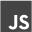

### 👋 Hello everyone, my name is _Stanislav_.

I'm a Fullstack developer.

<!--  -->

<!--  -->

<!-- ![Image alt]https://github.com/StanislavYurchenko/StanislavYurchenko/raw/master/img/git.svg){:height="36px" width="36px"}-->

<!-- 

 -->

<!--
**StanislavYurchenko/stanislavyurchenko** is a ✨ _special_ ✨ repository because its `README.md` (this file) appears on your GitHub profile.

Here are some ideas to get you started:

- 🔭 I’m currently working on ...
- 🌱 I’m currently learning ...
- 👯 I’m looking to collaborate on ...
- 🤔 I’m looking for help with ...
- 💬 Ask me about ...
- 📫 How to reach me: ...
- 😄 Pronouns: ...
- ⚡ Fun fact: ...
-->

<!--  

### Languages and Tools:

 
 

<!-- 
:zap: Github Stats
 -->

 
 

### Connect with me:

[][linkedin]
[][instagram]

[instagram]: https://instagram.com/did1van

[linkedin]: https://www.linkedin.com/in/ivan-fesenko-ba56b21a5 -->
